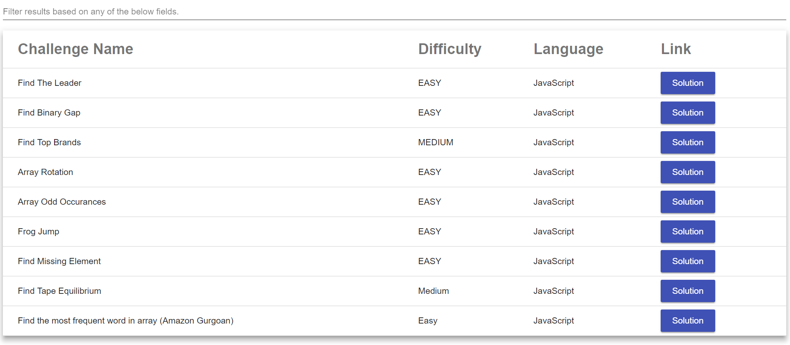
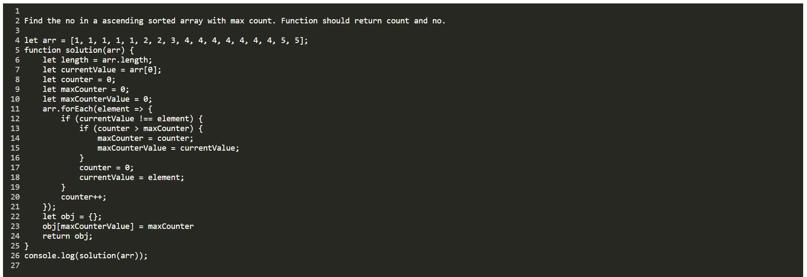

# Programming Challenges

This project was generated with [Angular CLI](https://github.com/angular/angular-cli) version 6.0.8.

## Installation
Download Node JS :: https://nodejs.org/en/download/  
Run in BASH      :: npm i 

## Development server

Run `ng serve` for a dev server. Navigate to `http://localhost:4200/`. The app will automatically reload if you change any of the source files.

## Adding new challenge

Folder named language contains challenge files.
language/index.ts and language/list.ts needs to be updated for new addition.

## Searching

Searching is based on any value in the list.ts.

## Challege

Solution File :: 
language/{language}/{difficulty}/{challengeName}/index

View File :: 
language/{language}/{difficulty}/{challengeName}/{filename}

